# **aula 13/08/24**
- estou doente
- instalar virtual box e linux mint no meu pc
- correção dos exercícios da última aula

# **Threads**
● Unidade básica de utilização da CPU;

● Composto por:

    – ID;

    – Contador de programa;

    – Conjunto de registradores;

    – Pilha.

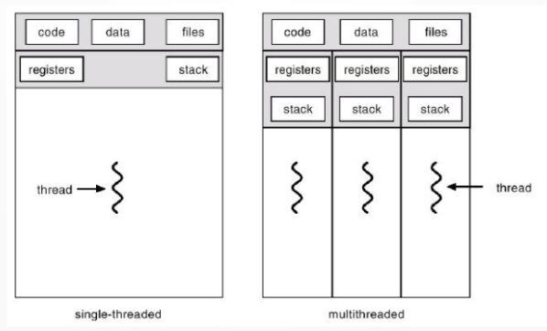

● Um editor de texto:

    – Thread para exibir interface gráfica;

    – Thread para receber a entrada do usuário;

    – Thread para corretor ortográfico;

● Processo com único thread

    – Cada tarefa realizada por vez (perda de desempenho);

## **Benefícios**
1) Capacidade de resposta:

    – O programa continua a ser executado mesmo de parte dele estiver bloqueada ou executando uma operação demorada.

    – Ex: Navegador internet baixando uma temporada de uma série c/ 20GB

2) Compartilhamento de recursos:

– Em processos: memória compartilhada ou mensagens;

    ● Programador deve organizar;

– Em threads → compartilhamento implícito

    ● Programador não se preocupa

3) Economia de recursos

    – Processo precisa de mais alocação de memória e recursos;

    – Redução de *overhead*.

## **Programação multi-core**

● Processadores hoje em dia possuem vários núcleos (cores) de processamento;

● Vantagem na implementação de várias threads:

    – Processo com 4 threads

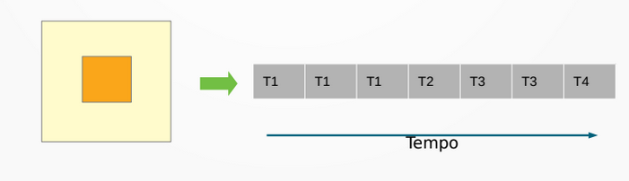

● Processadores hoje em dia possuem vários núcleos (cores) de processamento;

● Vantagem na implementação de várias threads:

    – Processo com 4 threads – 1 Processador 2 Cores

## Alguns desafios

● Divisão de atividades:

● Equilíbrio;

● Divisão de dados;

● Dependência de dados;

● Teste e depuração.

## Modelos Multithreads

● Suporte de threads em dois níveis

    – Threads de usuário: são as threads geradas pelos processos em execução a nível de usuário

        ● Navegadores, editores de texto, jogos, etc...

    – Threads de kernel: suportados e gerenciados pelo SO – são as threads com atividades internas do núcleo.

        ● Gerência de processos, rotinas de drivers dos dispositivos, etc

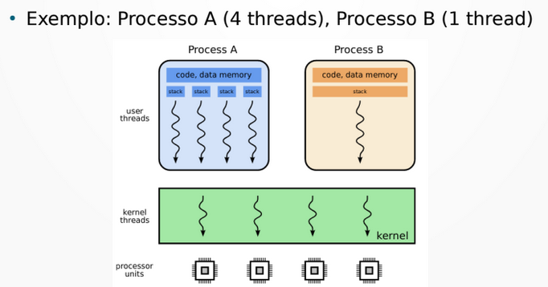

● As threads de usuário devem ser gerenciadas pelo núcleo do sistema operacional. Essa gerência pode ser feita de diversas formas através de modelos de implementação de threads:

    – Muitos-para-um

    – Um-para-um

    – Muitos-para-muitos

## Modelo Muitos-para-um

● Processo de usuário pode criar muitos threads, mas que são gerenciadas por um thread de núcleo 

● Na prática, é como se a aplicação tivesse só 1 thread

● Fácil implementação (do SO)

● Como o núcleo só vê 1 thread por processo a gerência imposta ao SO é menor

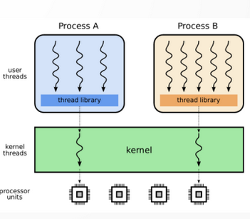

● Desvantagens:

● Operações de entrada e saída (ES) são realizadas pelo núcleo:

    – Logo, se um thread de um processo necessita acesso, todos os outros threads ficam suspensos até o retorno da operação de ES

● Threads do mesmo processo não executam em paralelo, mesmo se houver processadores disponíveis

● O tempo de processador dado a cada processo é o mesmo, independente de quantos threads cada processo possui

## Modelo um-para-um

● Um thread de usuário é mapeado para um thread de núcleo

● Processo não é bloqueado por um thread;

● Distribuição de tempo de processamento mais justa

● Mais demorado

    - Overhead de criação de thread de kernel.

● Não escalável: existem um limite no no de threads kernel

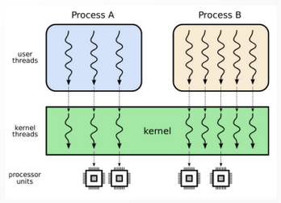

## Modelo muitos-para-muitos

● Mapeia um número x de threads de usuário a um número y de threads de núcleo, com x > y

● Sem as deficiências dos modelos anteriores.

    – Permite execução paralela de threads do mesmo processo;

    – Redução de overhead;

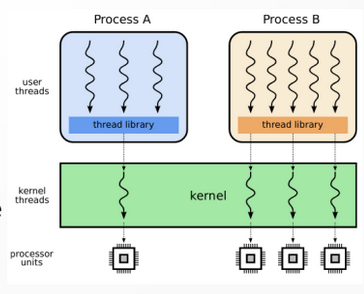

## Comparativo de modelos de threads

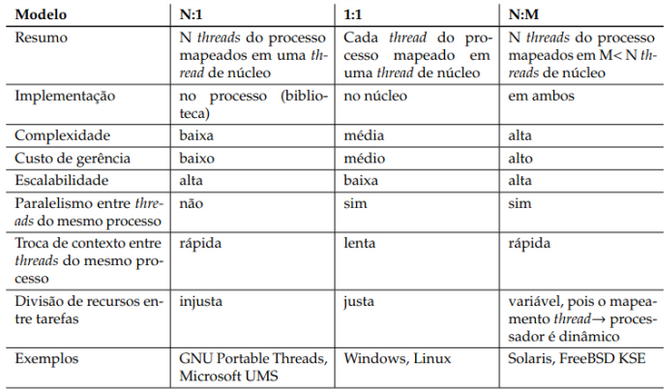

## Threads vs Cores

● Processadores podem ter um número x de cores e um número y, com y >= x de threads

● Nesse caso, threads é uma virtualização do núcleo de processamento

● Permite rodar mais processos de forma ‘simultânea’

    – A execução real é somente no x cores, porém a alternância entre os threads é extremamente rápida

● No Linux

    – 8 Cpus

    – 4 Núcleos

    – 8/4 = 2 threads por núcleo

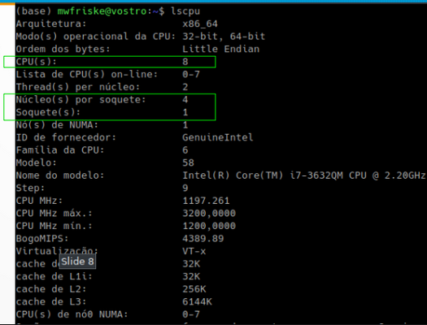

---
# **Escalonamento**

## Escalonamento de Processos

● Escalonador: Componente do sistema operacional responsável por definir a
ordem de execução dos processos.

    – Decidir qual será o próximo processo (na fila de prontos) a ser executado;

● Tipos de processos (aspecto temporal):

    – Tempo real: previsibilidade no tempo de resposta [fora do escopo]

● Controle de processos industriais, sistemas críticos (que podem causar prejuízos se falharem)

    – Interativos: respondem rapidamente a eventos externos

● Editores de texto, navegadores, jogos, servidores de rede, banco de dados, etc.

    – Em lote: ou background, executam sem intervenção de usuário

● Backup, varredura antivírus, renderização de vídeos

● Classificação de acordo com o uso do processador :

● CPU-bound: processos que usam intensivamente a CPU;

● IO-Bound: processos que realizam tarefas de entrada/saída

● Obs: Em sistemas que suportam threads, é realizado o escalonamento das threads de kernel, não dos processos.

## Critérios de escalonamento

● Métricas para avaliar escalonadores:

● Tempo de vida ($t_t$): tempo entre a criação de um processo e o seu término;

● Tempo de espera ($t_w$): tempo esperando na fila de processos prontos;

● Tempo de resposta ($t_r$): tempo de chegada de um evento ao sistema e a resposta a ele

● Justiça: distribuição adequada do processador entre os processos prontas.

● Eficiência: grau de utilização do processador.

## Escalonamento preemptivo e cooperativo

● Escalonamento cooperativo

    – O processo só perde o processador ao terminar, solicitar dispositivo de entrada/saída ou liberar explicitamente CPU, voltando a fila de processos prontos

● Escalonamento preemptivo

    – A cada interrupção, exceção ou chamada do sistema, o escalonador reavalia a fila de processos prontos e pode trocar o processo em execução.

## Tarefas e métricas

● Processos a serem escalonados:

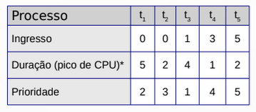

● Métricas:

    – Tempo médio de execução $T_t$

    – Tempo médio de espera $T_w$

## FCFS – First Come, First Servered

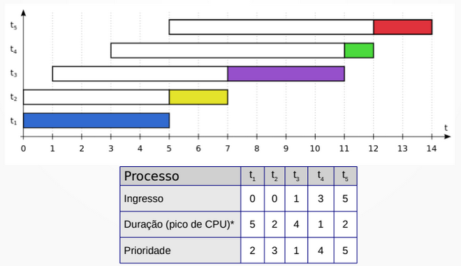

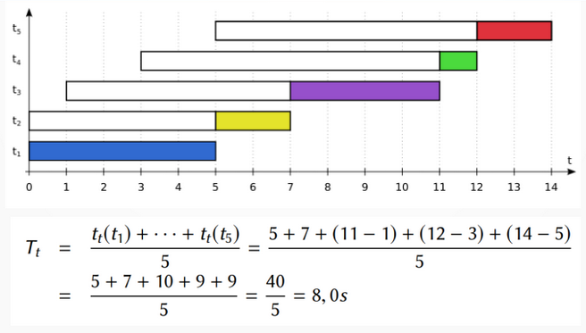

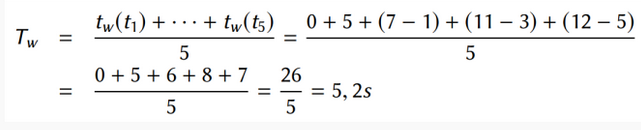

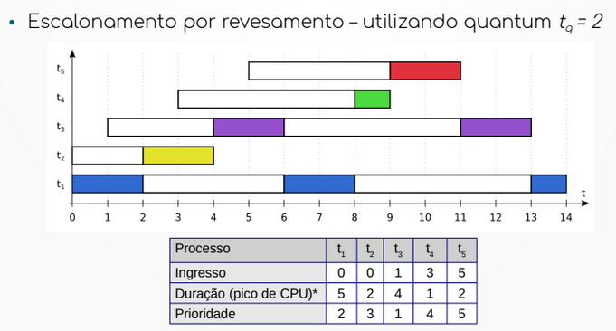

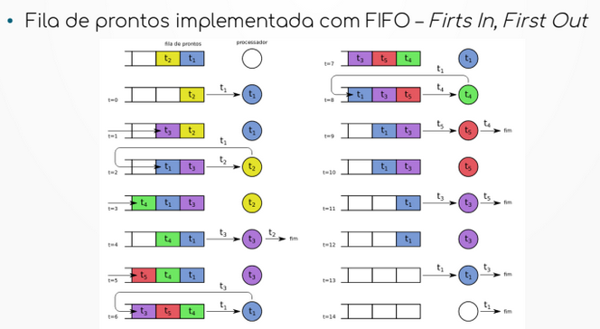

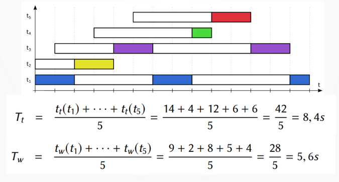

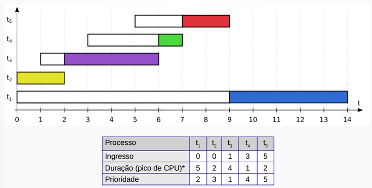

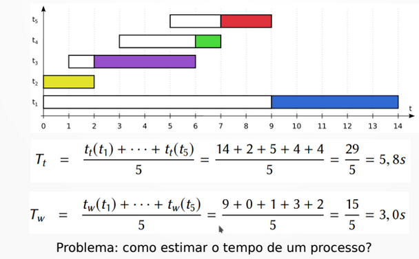

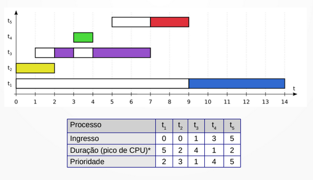

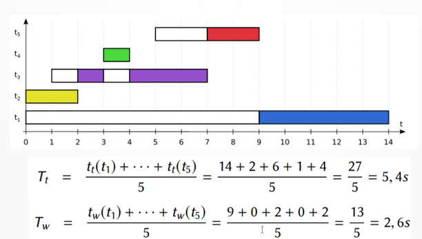

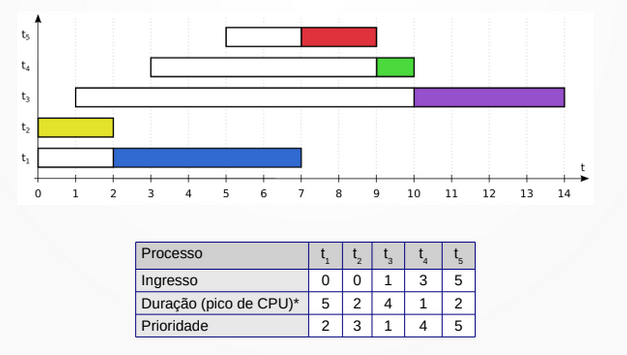

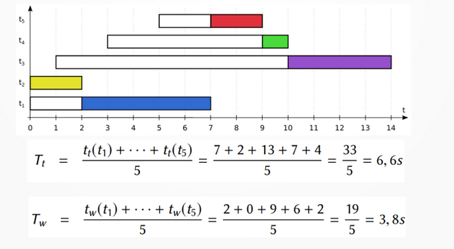

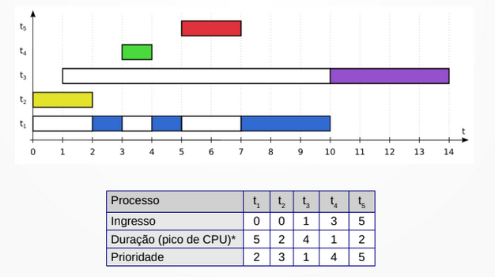

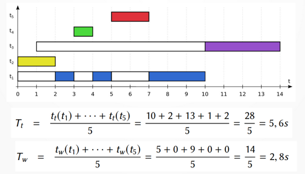

## PRIOd – Prioridade Dinâmica

● Problema:

    – Processos com baixa prioridade têm pouco acesso a CPU

    – Se houverem muitas tarefas, podem ficar parados

    – Fenomêno denominado de “inanição” (starvation)

● Solução

    – Aumentar gradativamente a prioridade do processo que não é executado

    – Ao executar, o procsso volta à sua prioridade original

    – Algoritmo de envelhecimento (aging)

## Um algoritmo de aging

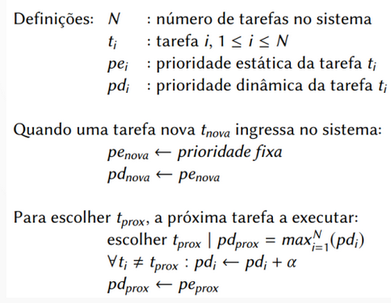

## PRIOd

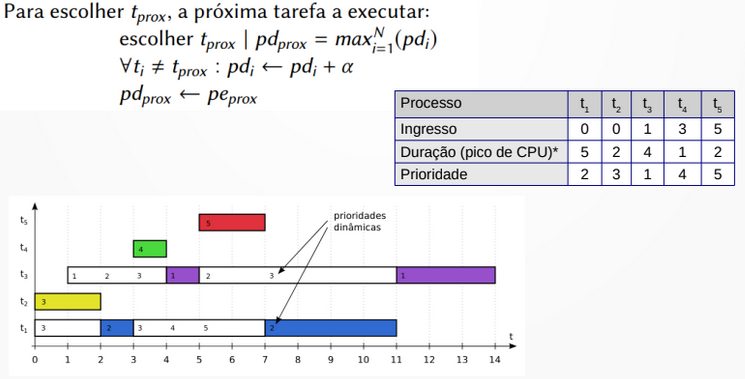

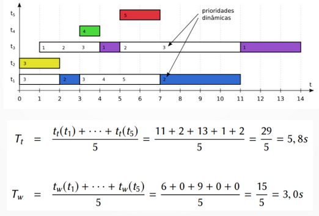

## Efeitos do envelhecimento

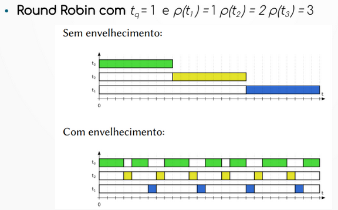

## Comparativo

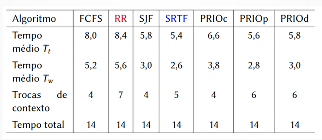

## Definição de prioridades

**● Fatores externos:**

– Informações de usuário/administrador:

    ● Classe do usuário (diretos, admin, usuário);

    ● Serviço básico ou premium

    ● Importância da tarefa (detector de intrusão, ...)

– O escalonador não pode estimar isso sozinho

– Definem um valor de prioridade estática

**● Fatores internos:**

– Informações obtidas pelo escalonador

– Estimadas com base em dados internos

    ● Idade da tarefa

    ● Duração estimada

    ● Interatividade

– Permitem calcular prioridade dinâmica

## Escalonadores em Sistemas Operacionais

**● Podem ser variações dos algoritmos apresentados e com incrementos**

**● Podem haver diferentes classes de processos de acordo com prioridade**